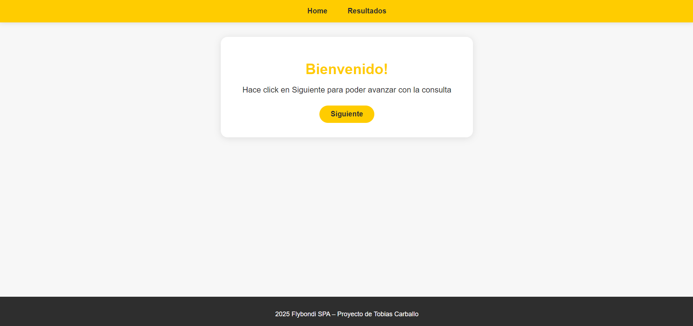
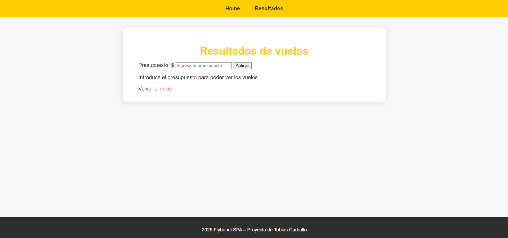
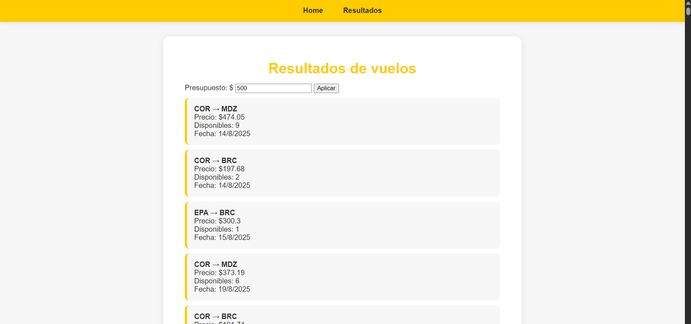

## 🛠️ Tecnologías y Herramientas

* **Lenguaje:** JavaScript (ES6+)
* **Estructura:** HTML5 / CSS3
* **Entorno:** Node.js (para gestión de dependencias y servidor local)

## 🚀 Cómo ejecutar el proyecto

Este proyecto utiliza **npm** para gestionar el servidor de desarrollo y asegurar una carga correcta de módulos.

### 1. Prerrequisitos
Tener instalado [Node.js](https://nodejs.org/) en tu equipo.

### 2. Instalación y Ejecución

1.  **Clonar el repositorio:**
    ```bash
    git clone [https://github.com/tobiascarballo/VanillaJS-Flight-Search-Engine.git](https://github.com/tobiascarballo/VanillaJS-Flight-Search-Engine.git)
    cd VanillaJS-Flight-Search-Engine
    ```

2.  **Instalar dependencias:**
    ```bash
    npm install
    ```

3.  **Iniciar el servidor de desarrollo:**
    ```bash
    npm run start
    ```
    *La aplicación se abrirá automáticamente en tu navegador (usualmente en http://localhost:3000 o similar).*

## 📷 Capturas de Pantalla




---
**Desarrollado por Tobías Carballo**
*Estudiante de Licenciatura en Sistemas | UADER*
[LinkedIn](https://www.linkedin.com/in/tobias-carballo/)